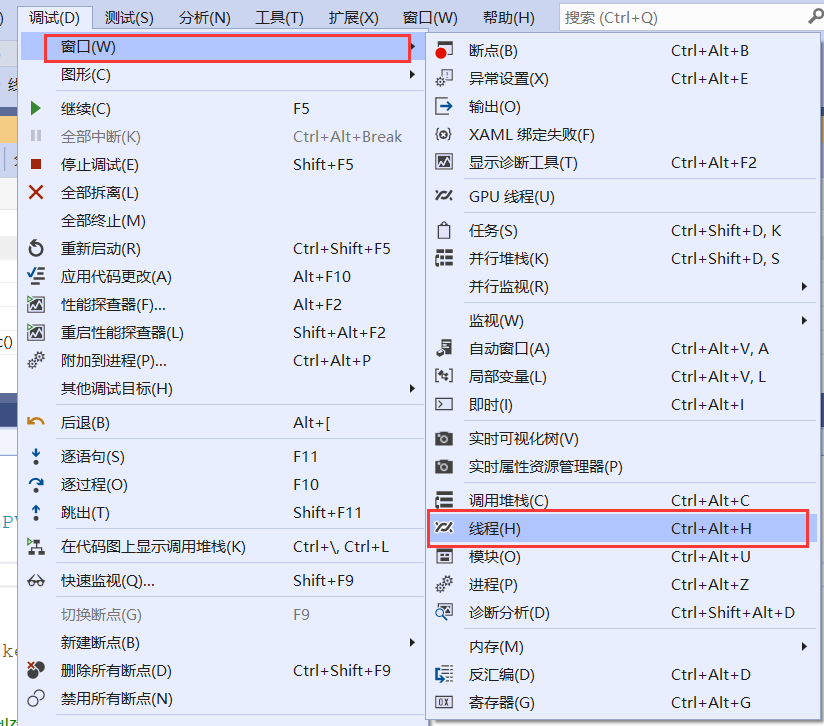

# 1. 理论
在使用Visual Studio创建项目时，这里选择x86生成的时32位应用程序，选择x64生成的是64位应用程序


无论是32位系统还是64位系统，只要系统上运行的是32位进程，那么系统就会为进程分配一块空间

4GB虚拟地址空间：
- 0x0000~64kB的空间：空指针模式，供程序员调试程序使用，不允许访问
- 64kB~2GB的空间：用户模式，进程的私有地址空间
- 2GB~4GB的空间：内核模式，所有进程共享的空间

如果是64位的进程，操作系统会为进程分配一块16TB的空间
- 0x0000~8TB的空间：用户模式，进程的私有地址空间
- 8TB~16TB的空间：内核模式，所有进程共享的空间

# 2. 创建进程
`CreateProcess()`

# 3. 结束进程
`TerminateProcess()`

# 4. 线程
进程：资源分配的基本单位</br>
线程：分配CPU的基本单位，进程中的一个基本单元

多个进程之间是轮换时间片来执行的，称为“并发”（多个执行命令交替执行）</br>
多核CPU的两个CPU上的进程同时执行，称为“并行”（多个执行命令同时执行）

线程：
- 用户级别的线程：在进程中被分配的，不被操作系统知道，操作系统按照进程给其分配时间片
    并不知道进程内如何运行
- 内核级别的线程：被操作系统直接操控，权限比较高的线程，

操作系统的用户和内核级线程的对应方式：
- 1对1：一个用户级别线程对应一个内核级别线程，
- n对1：n个用户级别线程对应一个内核级别线程
- n对m：

# 5. 创建线程
创建线程，操作系统会为线程分配两个东西（线程的组成）：
- 线程的栈：线程所需要的局部的、临时的资源。默认的线程栈大小为1MB
- 内核对象：操作系统通过内核对象来管理线程。组成：计数器、挂起计数器、信号
`CreateThread()`

通过调试中的线程监控窗口可以看到新创建的线程。


# 6. 进度条
我们实现一个功能，当按钮“go”按下的时候，进度条从0跑到100，一直循环
``` cpp
void CThreadDlg::OnBnClickedButton4()
{
	while (1)
	{
		m_process.StepIt();
	}
}
```
当写出这样的代码的时候，会发现整个应用程序被卡死，只能跑进度条，其他功能无法使用，
这是因为现在这个进程只有一个线程，跑进度条这个任务一直占用这个线程。

所以我们可以使用多线程来执行这个任务。修改后的代码如下：
``` cpp
DWORD WINAPI ThreadProc2(void* lpParameter)
{
	CThreadDlg* p_this = (CThreadDlg*)lpParameter;
	while (1)
	{
		(p_this->m_process).StepIt();
	}
	return 0;
}

void CThreadDlg::OnBnClickedButton4()
{
	CreateThread(NULL, 0, &ThreadProc2, this, 0, NULL);
}
```
当“GO”按钮按下的时候发生了什么？
- 当“go”按钮被按下时，进程给操作系统发送消息，操作系统将该消息放到系统消息队列中，
系统消息队列把该消息分发给当前进程的消息队列（应用程序消息队列），进程取消息、翻译、分发、
分发给唯一的消息入口点函数AfxWndProc，其将消息分发到对应窗口上，每个窗口上都有一个
消息映射表，通过查找消息映射表找到相应的处理函数，执行处理函数来响应消息，之后继续从
消息队列中取消息、翻译、分发...

# 7. 挂起和恢复线程
在线程的内核对象中有一个挂起计数器，每当线程被挂起时，挂起计数器加一，每当线程被恢复时，挂起
计数器减一，当挂起计数器的值为0的时候，线程才能运行。

注意：类成员定义完以后，一定要记得在构造函数中赋初值。

`sleep()`是延时函数，参数给需要延时的毫秒数，当`sleep(0)`的时候表示“让出本次时间片”

CEdit控件：https://blog.csdn.net/fly_wt/article/details/83685725


# 8. 结束线程
1. 正常结束线程：这里存在的问题是，当线程挂起的时候，推出线程是推出不了的
2. 强制退出线程：

